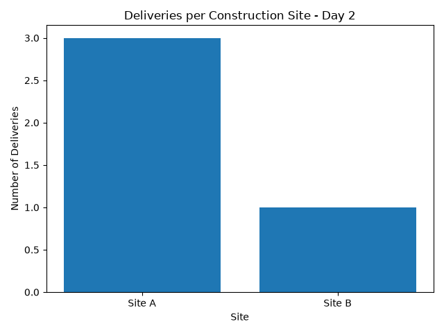
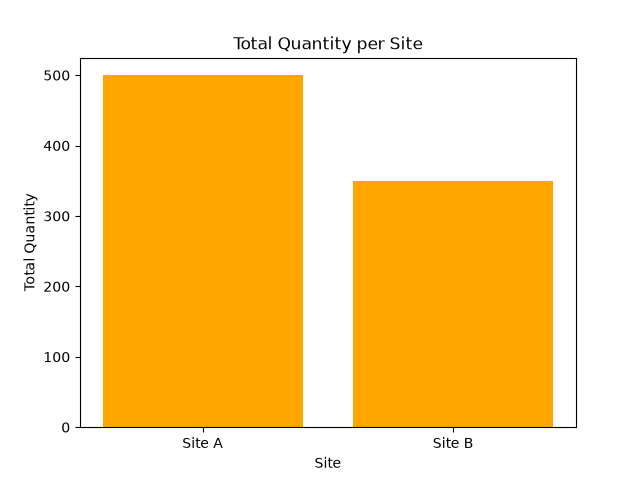

# de-101-pipeline
My first Data Engineering pipeline - Zero to Hero journey.
## 📊 Day 2 - Visualizations

- Site A: 3 deliveries, 500 units
- Site B: 1 delivery, ~350 units
## What it does
- Ingest raw CSV data
- Clean & transform with Python (Pandas)
- Save processed data ready for analysis

## Tech Stack
- Python, Pandas, Git, GitHub

## How to run
pip install -r requirements.txt
python scripts/extract_clean.py

## Author
Jazzy - Aspiring Data Engineer
